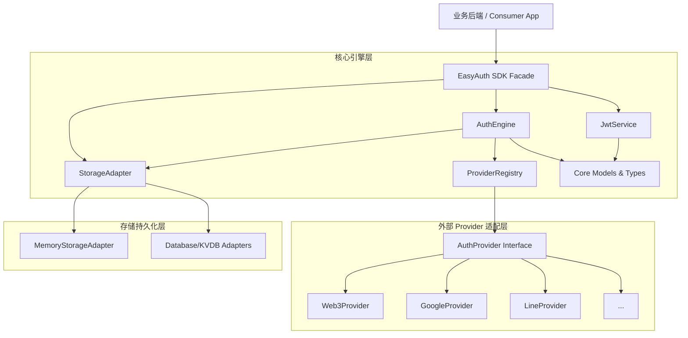

# ARCHITECTURE.md — Easy Auth 内部模块与数据流架构

> 本文档面向参与 Easy Auth 开发的 AI 与工程师，详细说明各子系统的内部职责、依赖方向、状态流转与边界隔离。

---

## 1. 模块依赖拓扑图

Easy Auth 遵循严格的单向依赖原则，杜绝跨层反向依赖与循环引用：



---

## 2. 核心子系统与职责说明

### 2.1 核心类型与错误体系 (`src/core/`)
- `types.ts`:
  - 定义只读或业务受控的 `User`、`Identity`、`UserMetadata`。
  - 定义认证请求与响应对象 `AuthResult`。
  - 核心设计：`User.id` 采用带有前缀的语义化 ID（例如 `usr_` + nanoid/uuidv4），`Identity.id` 采用 `idn_` 前缀。
- `errors.ts`:
  - 继承自标准 `Error` 的 `EasyAuthError`。
  - 携带显式的机器可读 `code: ErrorCode` 和易于排查的 `context`。

### 2.2 JWT 与请求验签服务体系 (`src/jwt/`)
- 采用无外部重型 C++ 原生绑定的现代加密库（如 `jose`）。
- 职责：
  1. `signUserToken(user: User, options?: SignOptions): Promise<string>`：签发包含用户 ID (`sub`) 与基础 metadata 快照的 JWT。
  2. `verifyUserToken(token: string): Promise<EasyAuthJwtPayload>`：校验过期、签名、篡改。
  3. `resolveVerification(token: string, options?: VerifyOptions): Promise<VerifyResult>`：结合存储层或纯 Payload 解析，直接提取并输出 `{ userId, metadata, user, payload }`。
- 纯函数化设计，无隐式全局秘钥，所有秘钥由初始化参数显式传入。

### 2.3 Provider 注册表与适配器体系 (`src/providers/`)
- **接口契约**：
  ```typescript
  export interface AuthProvider<TCredentials = any, TProfile = any> {
    readonly name: string;
    verifyAndExtract(credentials: TCredentials): Promise<{
      providerUserId: string;
      profile?: TProfile;
    }>;
  }
  ```
- **多范式扩展支持**：
  1. `Class-based`: 开发者直接实现 `AuthProvider` 接口（如内置的 `Web3Provider`、`GoogleProvider`）。
  2. `Template-based`: 内置 `OAuth2BaseProvider`，封装 code 换 token 与用户信息拉取标准流水线，接入新 OAuth2 仅需声明 URL 与字段映射。
  3. `Function-based`: `FunctionAuthProvider` 适配器，允许将单个验证函数直接提升为标准 Provider。
- **隔离性与边界**：每个 Provider 只负责自身登录载荷的合法性校验与统一提取，**严禁直接操作存储层或签发 JWT**。
- **注册中心** `ProviderRegistry`：维护 Provider 名称到实例的映射表，支持构造器注入与运行时 `register(provider)` 热插拔。

### 2.4 认证编排引擎 (`src/core/auth-engine.ts`)
- 作为系统的领域业务心脏，协调 `ProviderRegistry`、`StorageAdapter` 与 `JwtService`：
  1. **执行认证验证**：调用对应 Provider 的 `verifyAndExtract`。
  2. **身份映射查找**：通过 `(provider, providerUserId)` 查询已有 `Identity`。
  3. **用户判定**：
     - 若存在，直接载入关联的 `User`。
     - 若不存在，发起原子创建：新建 `User`，并新建 `Identity` 关联至该 `User`。
  4. **签发凭证**：调用 `JwtService` 签发 JWT，并组装 `AuthResult`。

### 2.5 身份绑定引擎 (`src/core/linking-engine.ts` 或集成于 `AuthEngine`)
- **关联逻辑 (Link)**：
  - 传入当前登录用户的 `userId`。
  - 校验目标第三方凭证，提取目标 `(provider, providerUserId)`。
  - 检查该目标身份是否已存在：
    - 若已归属同一 `userId`：幂等返回。
    - 若已归属其他 `userId`：立即阻断并抛出 `IDENTITY_ALREADY_LINKED`。
    - 若未被绑定：创建新 `Identity` 记录并关联至当前用户。
- **解绑逻辑 (Unlink)**：
  - 查询用户名下所有的 `Identity` 列表。
  - 校验总数：若 `identities.length <= 1`，强行阻断并抛出 `CANNOT_UNLINK_LAST_IDENTITY`。
  - 执行删除目标 `Identity` 记录。

### 2.6 存储抽象层 (`src/storage/`)
- 提供统一接口 `StorageAdapter`。
- 默认提供 `MemoryStorageAdapter`：采用 `Map<string, User>` 和双索引 `Map<string, Identity>`，确保本地测试与无数据库环境 0 成本启动运行。

---

## 3. 核心设计约束 (面向 AI)

1. **零全局变量**：所有状态均挂载在 `EasyAuth` 实例上下文中，支持同一 Node.js 进程内创建多个隔离的 EasyAuth 实例（例如多租户场景）。
2. **异步非阻塞**：所有对外方法均返回 `Promise`，便于后续无缝迁移至各类异步网络数据库与分布式存储。
3. **输入数据清洗**：例如 Web3 地址必须由 Provider 统一处理为小写（`address.toLowerCase()`），避免因大小写不一致导致同地址被注册两次。
